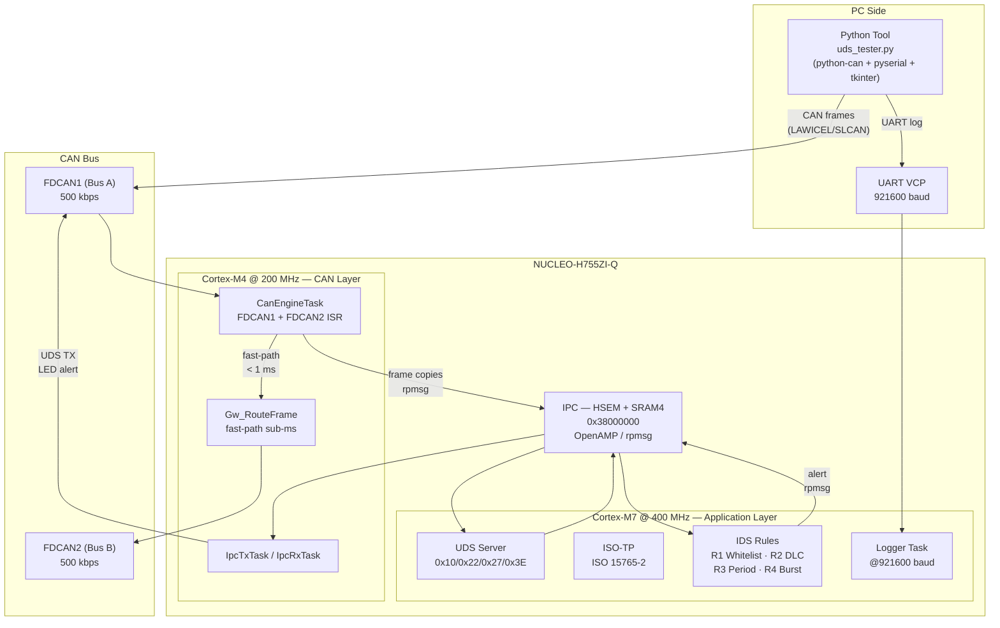
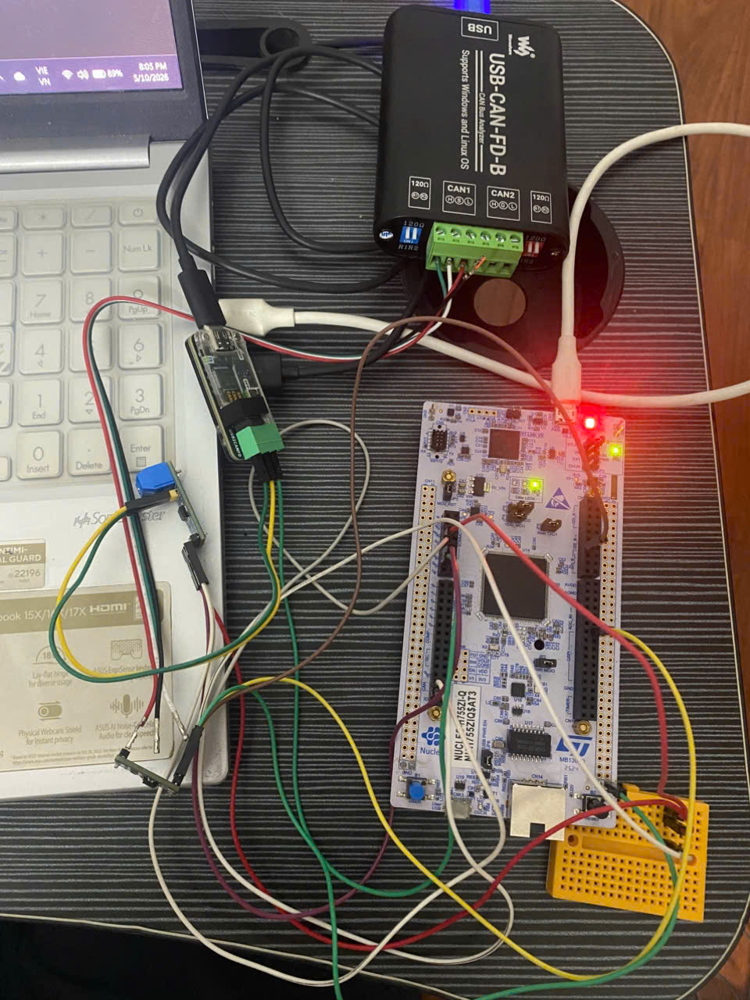
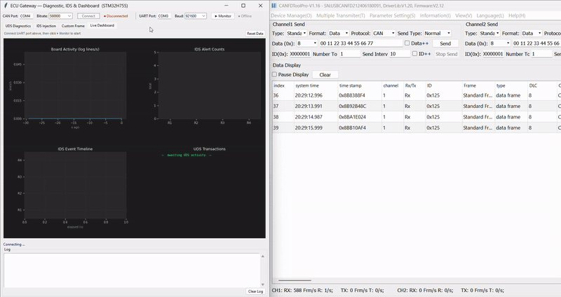

# ECU Gateway — STM32H755 Dual-Core

> **Hybrid Automotive Gateway** combining **CAN Routing**, **UDS Diagnostic Stack (ISO 14229)**, and **Lightweight Intrusion Detection** on an STM32H755 (Cortex-M7 @ 400 MHz + Cortex-M4 @ 200 MHz) with OpenAMP/HSEM IPC.

---

## Architecture



---

## Features

| Feature | Detail |
|---|---|
| **CAN Routing** | Bidirectional FDCAN1 ↔ FDCAN2, hardware filter 0x100–0x1FF, sub-ms fast-path (CM4 local, no IPC) |
| **UDS Diagnostic** | ISO 14229 over ISO-TP (ISO 15765-2): `0x10` Session Control, `0x22` ReadDataByIdentifier, `0x27` SecurityAccess, `0x3E` TesterPresent |
| **Intrusion Detection** | R1 ID whitelist (O(1) array), R2 DLC anomaly, R3 period anomaly, R4 token bucket burst flood |
| **Dual-core IPC** | HSEM + shared SRAM4 (`0x38000000`, non-cacheable MPU) + EXTI 60/61 via OpenAMP/rpmsg — **no IPCC** (H755 doesn't have it) |
| **Python Dashboard** | Live 4-panel GUI: board activity rate, IDS alert bar chart, IDS event timeline, UDS transaction log |
| **AUTOSAR-style layers** | CM4 ≈ MCAL (FDCAN driver), CM7 ≈ BSW+Application (UDS, IDS, routing table) |

---

## Hardware Setup

<p align="center">
  
</p>

**Bill of Materials:**
- NUCLEO-H755ZI-Q (STM32H755ZIT6)
- 2× Classic CAN transceiver (SN65HVD / VP230 on Bus A, TJA1042 on Bus B)
- 2× 120 Ω termination resistors
- USB-to-CAN adapter (LAWICEL/SLCAN compatible — single channel)
- Waveshare USB-CAN-B or similar for Bus B monitoring (WinUSB, CANFDToolPro)

**Pin mapping:**

| Signal | Pin | Notes |
|---|---|---|
| FDCAN1 TX/RX | PD1 / PD0 | Bus A → PC (USB-to-CAN) |
| FDCAN2 TX/RX | PB13 / PB12 | Bus B → ECU node / analyzer |
| USART3 VCP | PD8 (TX) / PD9 (RX) | Debug UART → ST-LINK COM @ 921600 |
| LED1 (blue) | PB0 | CM7 alive, blink 500 ms |
| LED2 (yellow) | PE1 | IDS alert (CM4, toggle on alert) |
| LED3 (red) | PB14 | CM4 alive, blink 250 ms |

---

## Performance

| Metric | Target | Measured |
|---|---|---|
| CM7 SYSCLK | 400 MHz | ~403 MHz ✅ (DWT, ±1%) |
| memcpy 1 KB (no cache) | — | 11 027 cycles |
| memcpy 1 KB (D-Cache) | — | 2 072 cycles → **5.3× speedup** |
| OpenAMP RTT (CM7 ↔ CM4) | < 100 µs | **30.27 µs** ✅ |
| UDS 0x22 response | < 50 ms | < 1 s ✅ (single-bus, Python tester) |
| IDS R4 fire threshold | < 30 frames | ≈ 15 frames ✅ (token=15, refill=1/100ms) |
| FDCAN1 ↔ FDCAN2 routing | < 1 ms | sub-ms ✅ (CM4 fast-path, no IPC) |

---

## Demo



> **Left window:** ECU Gateway Python tool — UDS panel + IDS injection + Live Dashboard (4-panel matplotlib).
> **Right window:** CANFDToolPro showing routed frames on FDCAN2 Bus B.

---

## Project Structure

```
ECU_Gateway/
├── CM7/                        # Cortex-M7 sub-project — Application Layer
│   ├── Core/{Inc,Src,Startup}
│   └── App/
│       ├── gateway/            # Gw_RouteDecide() — routing table
│       ├── uds/                # UDS state machine + service handlers
│       ├── iso_tp/             # ISO-TP TX/RX segmentation (ISO 15765-2)
│       ├── ids/                # IDS rules R1–R4
│       └── shared/             # rpmsg RX/TX (IPC bridge to CM4)
├── CM4/                        # Cortex-M4 sub-project — CAN Layer
│   ├── Core/{Inc,Src,Startup}
│   └── App/
│       ├── can_engine/         # FDCAN1/FDCAN2 ISR + CanEngineTask + Gw_RouteFrame()
│       └── shared/             # rpmsg TX/RX (IPC bridge to CM7)
├── Common/Src/                 # Gw_Frame_t + shared ID enums (both cores)
├── Middlewares/Third_Party/    # OpenAMP + FreeRTOS
├── Drivers/                    # STM32 HAL + CMSIS
├── tools/
│   └── uds_tester.py           # Python GUI: UDS · IDS Inject · Custom Frame · Live Dashboard
├── log/
│   ├── demo.gif                # Demo recording
│   └── setup.jpg               # Hardware setup photo
├── Documents/                  # Reference PDFs (RM0399, AN5617, trimmed)
└── ECU_Gateway.ioc             # STM32CubeMX project (NUCLEO-H755ZI-Q)
```

---

## Build & Flash

### Requirements

- **STM32CubeIDE** ≥ 1.13 (GCC ARM toolchain included)
- **STM32CubeProgrammer** (for recovery if needed)
- Python 3.10+ with: `pip install python-can pyserial udsoncan matplotlib`

### Build

```bash
# Open STM32CubeIDE
# File → Import → Existing Projects → select ECU_Gateway/
# Build CM7 sub-project first, then CM4
# Project → Build All
```

> ⚠️ After adding/removing source files, always run **Project → Clean** to regenerate `subdir.mk`.

### Flash

```bash
# In CubeIDE: Run → Debug Configurations
# Launch CM7 debug config first (it holds CM4 in reset via HSEM)
# Then attach CM4 debug config
# Both cores boot and hand-shake via OpenAMP automatically
```

### Clock note

- CM7 runs at **400 MHz** (VOS1, `PWR_DIRECT_SMPS_SUPPLY`) — **not** 480 MHz (VOS0 causes hang on Nucleo SB8).
- FDCAN clock source = PLL2 @ 80 MHz (configured in `.ioc`).

---

## Python Tool

```bash
cd tools/
pip install python-can pyserial matplotlib udsoncan

# Run
python uds_tester.py
```

**Usage:**
1. **CAN Interface** — select adapter type (slcan/socketcan), set port/channel, click **▶ Connect**
2. **UART Monitor** — select COM port (ST-LINK VCP), click **▶ Monitor** to stream board logs
3. **UDS** tab — send DiagnosticSessionControl / ReadDID / SecurityAccess / TesterPresent
4. **IDS Inject** tab — flood Bus A with test frames to trigger R1–R4 rules
5. **Custom Frame** tab — send arbitrary CAN frames
6. **Live Dashboard** tab — 4-panel real-time view (activity rate, IDS alert counts, timeline, UDS log)

**Build executable:**
```bash
pyinstaller --onefile --windowed \
  --hidden-import matplotlib.backends.backend_tkagg \
  uds_tester.py
```

---

## IDS Rules

| Rule | Trigger | Action |
|---|---|---|
| **R1** Whitelist | Frame ID not in allowed set (0x100–0x1FF, 0x7E0, 0x7E8) | Alert → CM4 LED toggle |
| **R2** DLC | DLC > expected for that ID | Alert |
| **R3** Period anomaly | Inter-frame interval < (nominal period − jitter) | Alert |
| **R4** Burst flood | Token bucket drained (capacity=15, refill=1/100ms) | Alert |

---

## UDS Services

| SID | Service | DID / Detail |
|---|---|---|
| `0x10` | DiagnosticSessionControl | Default / Extended / Programming |
| `0x22` | ReadDataByIdentifier | `0xF187` SW Part Number, `0xF18C` ECU Serial, `0xF195` SW Supplier |
| `0x27` | SecurityAccess | Seed/key (XOR-based, demo-grade) |
| `0x3E` | TesterPresent | S3 server timeout 5 s |

---

## Architecture Decisions

| ADR | Decision |
|---|---|
| ADR-001 v2 | CM4 runs FreeRTOS lightweight |
| ADR-005 | Clock 400/200 MHz (VOS1) — avoid VOS0 on Nucleo |
| ADR-006 | Classic CAN transceiver, FDCAN in compatibility mode |
| ADR-008 | **CM4 owns FDCAN1+FDCAN2**; CM7 does NOT init FDCAN. Fast-path routing is CM4-local (no IPC). |

---

## References

- RM0399 — STM32H745/755 Reference Manual
- AN5617 — OpenAMP on STM32 dual-core
- ISO 14229-1 — UDS
- ISO 15765-2 — ISO-TP
- ISO/SAE 21434 — Automotive Cybersecurity (IDS design mindset)

---

*Built as a Bosch Embedded Intern portfolio project — STM32H755 dual-core, AUTOSAR-style layering, real CAN hardware.*
